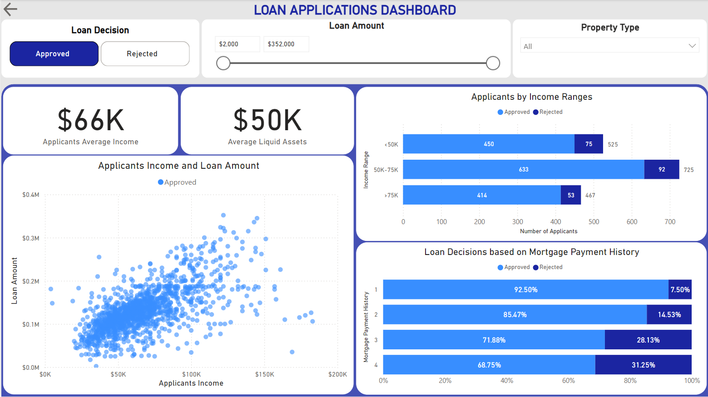
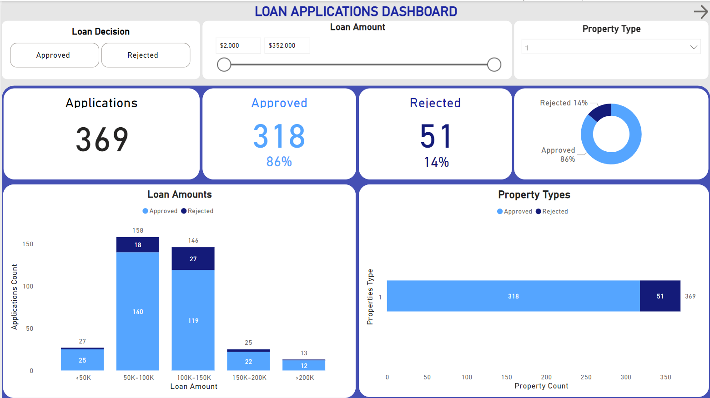

# Loan Applications Analysis

**Tools Used: Python (Jupiter Notebook), Power BI**

## Background
The Explanatory Data Analysis on a Bank's Application Loan Data, in order to identify:
- Main trends among all applications, focusing on loan decisions, loan amount, and property types of loans.
- The differences between approved applications and rejected ones.
- Factors that significant to the loan amount, and the Model to estimate the loan amount of a new applicant.
- The low-risk model that accurately predicts loan decisions.

## Data sources and Files

Datasets of the Analysis can be be found in the [datasets](./datasets/) folder:
- *loanapp.csv:* The dataset contains data on loan applications to a bank, including various types of information on the applicant and the purpose of the loan, along with the eventual loan decision
- *loanapp_desc.txt:* A detailed description of the dataset columns 

The Interactive Power BI Dashboard can be downloaded [here](./BI_report_loan_app.pbix).

The detailed Statiscal Analysis can be found [here](./loan_appications_analysis.ipynb).

The Project's directory structure:
```
loan applications/
├── visuals/ # visualisations folder 
├── datasets/
│   ├── loanapp.csv
│   ├── loan_applications_BI.scv # dataset of BI dashboard
│   └── loan_app_detail.txt
├── loan_appications_analysis.ipynb # main analysis and insights
├── BI_report_loan_app.pbix # Power BI interactive dashboard
└── readme.md
```

## Executive Summary

### Loan Decisions:
- **87%** of loans were **approved**, **13%** were **rejected**.
- **90%** of loans that applied for purchasing property **type 2** were **approved** .
- The *average annual income* and *average liquid assets value* of **approved** applicants is significantly greater than that of **rejected** applicants.
- The higher an applicant *Mortgage Payment History Score* is, the more likely their application is being **rejected**.

### Loan Amount:
- Majority of loans (**47%**) are around **$100,000** to **$150,000**.
- Most applicants (**98.6%**) applied for loans less or equal to the *Purchase Price*.
- **94%** applicants applied for loans that larger than **50%** of the *Purchase Price*.
- Most influential factors to an application's loan amount: applicant's income, value of their liquid assets, property type and its purchase price.

### Property Types:
- Most of loans (**70%**) applied for purchasing Property **Type 2**, while this of **Type 3** is only **9%**

### Proposed Questions:
- Which criteria does the bank currently prioritise when approving or rejecting loans?
- Are there concerns about bias in the current decision-making process of loans?
- What is the bank's target distribution for loan amounts (e.g. ideal percentage of approved loans below $100,000)?
- Should the analysis consider external factors (e.g., market trends or economic conditions) that may influence rejections?
- Is the bank more interested in minimising false rejections (rejecting good applicants) or false approvals (approving risky applicants)?

## Insights Deep-dive
### 1. Loan Applications Overview


- Majority of Loans (**47%**) are around **$100,000** to **$150,000**.
- **87%** of loans were **approved**, **13%** were **rejected**.
- Most of loans (**70%**) applied for purchasing **Property Type 2** .


- The `Average Income` of Applicants is **$66,000**.
- The `Average Liquid Assets Value` of Applicants is **$48,000**.
- Most Applicants (**42%**) have their `annual income` between **$50,000 to $75,000**.
- The higher an applicant `Mortgage Payment History Score` is, the more likely their application is being **rejected**.
- **92.5%** of applications with `Mortgage Payment History Score` of **1** were **Approved**.

### 2. `Loan Decision` Analysis

#### Statistics of `Appoved` Applications:


#### Statistics of `Rejected` Applications:


Accoring to the Dashboard's visualisations and the Statistical tests performed:

- The `Average Yearly Income` of **Approved** applicants (**$66,000**) is significantly greater than that of **Rejected** applicants (**$63,000**).
- The `Average Liquid Asset Value` of **Approved** applicants (**$50,000**) is significantly greater than that of **Rejected** applicants (**$35,000**).
- There no significant differences in `Mortage Payment History` and `Consumer Credit History` between **Approved** and **Rejected** Applications. 
- There are significant associations between applicant's `Self-Empoyed`, `Filed-Bankruptcy` statuses and their `Loan Decision`.

#### `Loan Decision` Prediction Model:
The predictive model (Logistic Regression) of a loan's decision based on the applicant's provided information, with **69%** accuracy for loan **rejections** and **68%** for **approvals**: [here](./loan_appications_analysis.ipynb).

### 3. `Loan Amount` Analysis

#### `Loan Amount` vs. Properties' `Purchase Price`:
Applicant have the tendency to apply for loans less or close to `Purchase Price`, with **98.6%**:
- **94%** applicants applied for loans that larger than **50%** of the `Purchase Price`, and **78%** applied for loans greater than **70%** of `Purchase Price`. 


####  `Loan Amount` vs. Applicants' `Income`:
As an applicant's annual `Income` increases, their `Loan Amount` also increases:


#### Most influential factors to an Application's `Loan Amount`: 
- Applicant's `Monthly Income` and `Annual Income`.
- `Property Type`.
- Property `Purchase Price`. 
- Amount of an applicant's `Liquid Assets` value.

#### The Prediction Model for `Loan Amount`:
The predictive model of a loan's amount based on the applicant's provided information, explains **70%** *(R-squared = 0.7)* of the variability in the loan amounts: [here](./loan_appications_analysis.ipynb).

### 4. `Property Types` Analysis

#### Loans to purchase **Property Type 1**:


#### Loans to purchase **Property Type 2**:


#### Loans to purchase **Property Type 3**:


Loan Decisions:
- Properties of **Type 2** account for the most loans (**70%**), and also for the highest **approved** percentage (**90%**)
- Properties of **Type 3** account for the least loans (**9%**), and for the lowest **approved** percentage (**69%**) - or **31%** of **rejection**.

Loan Amounts:
- Majority (**43%**) of Loans for **Type 1** Properties were between **$50,000 to $100,000**, while this of the **$100,000 to $150,000** range is **40%**. 
- Majority (**51%**) of Loans for **Type 2** Properties were between **$100,000 to $150,000**.
- **36%** of Loans for **Type 3** Properties were between **$150,000 to $200,000**, while this of the **$100,000 to $150,000** range is **35%**.
 
## Recommendations
- **Focus on Popular Loan Ranges:** Design loan products around the most common loan range (**$100,000 to $150,000**), with flexible options for applicants.

- **Increase Appeal of Loans for puchasing Property Type 3:**
Develop targeted campaigns or incentives to attract applicants for **Property Type 3**, which currently makes up only **9%** of loans.

- **Review Loan thresholds based on Purchase Price**:
Since **94%** of applicants request loans that are more than half of the `purchase price`, adjust policies to attract more applicants that wish to apply for loans with smaller amount (loans with lower default risk).
